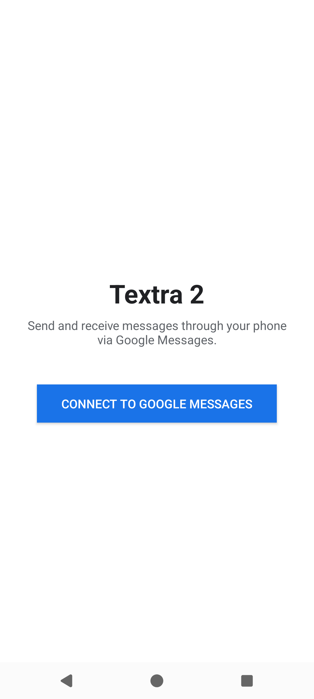

# Textra with RCS and spam block

A modified **Textra 2** SMS/messaging app that sends and receives through your phone's
**Google Messages** account (the same mechanism as *Messages for web*), plus an on-device
**scam/spam filter**.

Instead of running an always-on background service, it uses a **zero-background-battery**
design: a notification listener wakes the app only when Google Messages posts a notification
for an incoming message, then connects briefly to sync. (See *Notifications* below — this is
why Google Messages notifications must stay **enabled**, and why **silent** is recommended.)

---

## How to connect to Google Messages

> The first two steps are shown on real screenshots below (captured on an emulator).
> Steps 3–5 happen against **your own Google account and your phone**, so they are
> described in text rather than screenshotted.

### 1. Open the app and tap **CONNECT TO GOOGLE MESSAGES**

When you first open Textra 2 you'll see the connect screen with a large blue button:

### 2. Sign in with your Google account

Tapping the button opens Google's real sign-in page inside the app. **Sign in with the same
Google account that your phone's Google Messages app uses** — this is the account whose texts
you want to send and receive.

### 3. Complete sign-in

Enter your email/phone → **Next** → password → approve any 2-step verification prompt, exactly
as you would in a browser. Once Google returns you, the app shows
**"Signed in. Talking to Google Messages…"**

### 4. Confirm the pairing emoji on your phone

The app then shows a **confirmation emoji**. On your phone, Google Messages displays a
"pair a new device" prompt with an emoji. **Check that the two emojis match, then approve it
on the phone.** This is the standard Google Messages device-pairing confirmation.

### 5. Paired

The app shows **"Paired to Google Messages."** Outgoing texts now route through Google
Messages, and incoming texts wake the app via the notification listener. The pairing is saved,
so you won't have to repeat this unless you sign out.

After pairing, the app prompts for two **one-time** grants (they persist across reboots — no
per-boot setup):

- **Notification access** — tap the on-screen prompt and enable **"Textra 2 message wake-up"**.
  This is how the app knows a new message arrived. *Without it, incoming messages won't wake the app.*
- **Unrestricted battery / disable battery optimization** — so the brief on-demand connect
  isn't delayed while the phone is idle (Doze).

---

## Notifications: keep Google Messages notifications ON, set them to **Silent**

The wake-up mechanism listens for **Google Messages' own notifications**. So:

- **Keep Google Messages installed and its notifications ENABLED.** If you turn Google Messages
  notifications off, Textra 2 will never wake for incoming messages.
- **Set Google Messages notifications to Silent.** The listener still fires on a silent
  notification, so wake-up keeps working — but you won't get a sound/buzz/heads-up banner from
  Google Messages on top of your Textra 2 alert. You get one alert (from Textra 2), not two.

**How to silence Google Messages notifications (on your phone):**

1. Long-press a Google Messages notification → tap the gear / **"Silent"**, **or**
2. **Settings → Apps → Messages (Google Messages) → Notifications**, and set the message
   categories to **Silent** — *keep the category toggle ON*, just move it from "Default/Alerting"
   to "Silent".
3. (Optional) Hide Google Messages notifications from the lock screen so only Textra 2 shows.

> Do **not** fully disable Google Messages notifications — silent ≠ off. Silent keeps the wake
> trigger alive while staying quiet.

---

## Spam / scam block

The app includes an on-device scam/spam filter with its own launcher icon, **"Textra Spam
Filter"** (`SpamSettingsActivity`). It classifies incoming messages by matching links and
senders against external threat feeds offline, with optional online lookups. Open the
**Textra Spam Filter** icon to toggle protection, enable/disable online lookups, set feed
URLs/keys, and refresh feeds.

---

## Status / verification

- Screenshots **1–2** above were captured by driving the app on a redroid emulator this
  session (real UI render, `PairingActivity`).
- Steps **3–5** (Google credential entry, emoji match, paired confirmation) and the
  silent-notification screens require a real Google account + phone with Google Messages, so
  they are documented in text and **not** emulator-verified here.

## Build

Latest APK in this repo: `textra2_v1.07.0.apk` (package `com.textra2`). See `CHANGELOG.md`
and `docs/` for build details and the engine integration kit.
