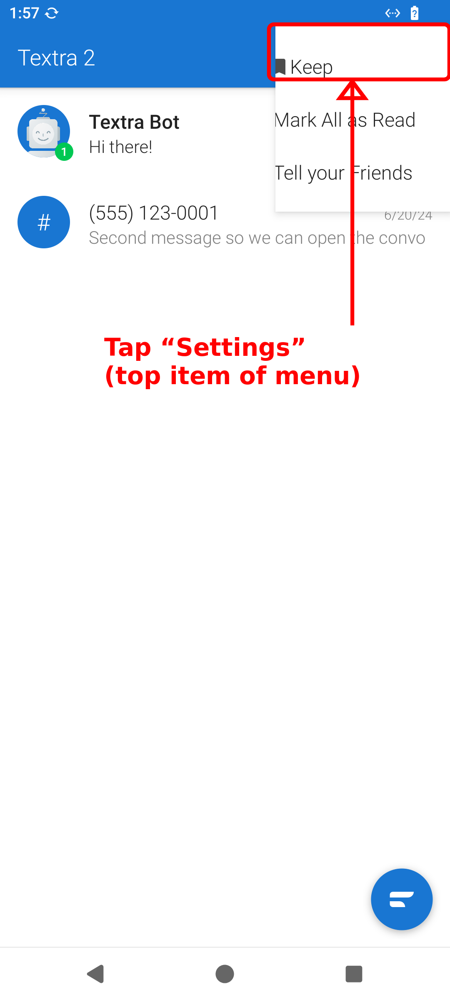
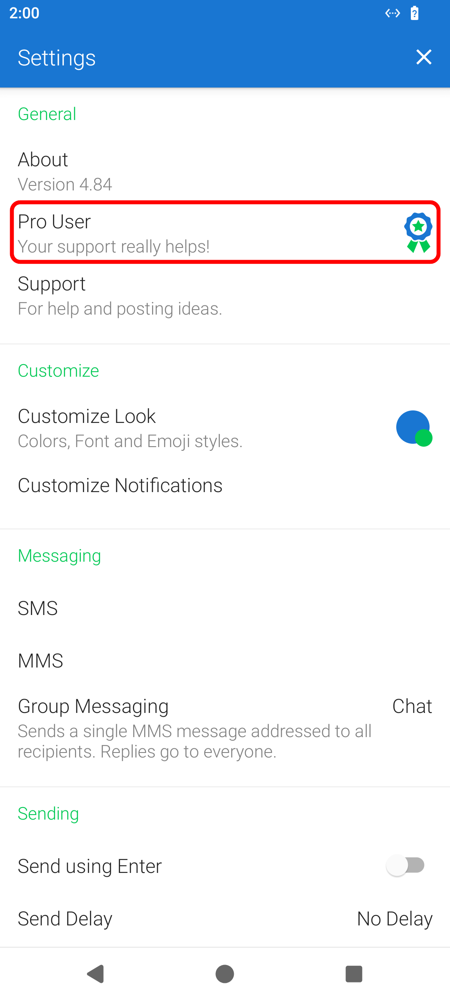
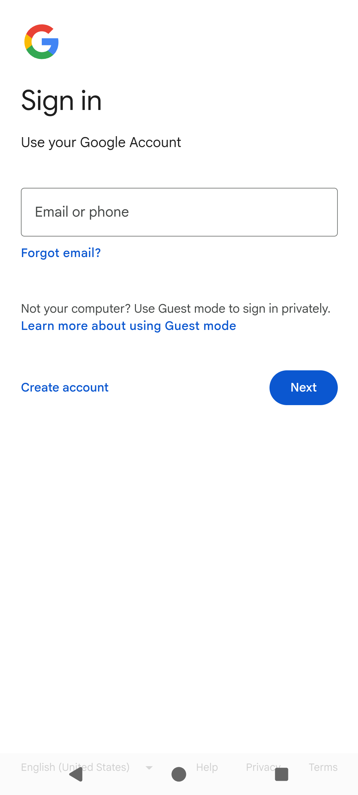

# Textra with RCS and spam block

A modified **Textra 2** SMS/messaging app that sends and receives through your phone's
**Google Messages** account (the same mechanism as *Messages for web*), plus an on-device
**scam/spam filter**.

Instead of running an always-on background service, it uses a **zero-background-battery**
design: a notification listener wakes the app only when Google Messages posts a notification
for an incoming message, then connects briefly to sync. (See *Notifications* below — this is
why Google Messages notifications must stay **enabled**, and why **silent** is recommended.)

---

## How to connect to Google Messages

> Steps 1–4 are shown on real screenshots captured by driving the app on an emulator.
> Steps 5–6 happen against **your own Google account and your phone**, so they are described
> in text (they need real credentials + the phone's Google Messages and aren't emulator-captured).

### 1. Open the ⋮ menu and tap **Settings**

In Textra 2's conversation list, tap the **⋮ overflow menu** (top-right). **Settings** is the
**top item** of the dropdown:

### 2. Tap **Pro User**

In Settings, under **General**, tap **Pro User** (the row with the blue ribbon). In this build
that entry opens the Google Messages connect screen:

### 3. Tap **CONNECT TO GOOGLE MESSAGES**

### 4. Sign in with your Google account

The button opens Google's real sign-in page inside the app. **Sign in with the same Google
account that your phone's Google Messages app uses** — that's the account whose texts you want
to send and receive.

### 5. Finish sign-in and confirm the pairing emoji

Enter email/phone → **Next** → password → approve any 2-step verification, exactly as in a
browser. The app then shows a **confirmation emoji**. On your phone, Google Messages shows a
"pair a new device" prompt with an emoji — **check the emojis match, then approve it on the
phone.** The app shows **"Paired to Google Messages."**

### 6. Grant the two one-time permissions

After pairing, the app prompts for two grants. Both are **one-time** and persist across reboots
(no per-boot setup):

- **Notification access** — enable **"Textra 2 message wake-up"**. This is how the app knows a
  new message arrived. *Without it, incoming messages won't wake the app.*
- **Unrestricted battery / disable battery optimization** — so the brief on-demand connect
  isn't delayed while the phone is idle (Doze).

---

## Notifications: keep Google Messages notifications ON, set them to **Silent**

The wake-up mechanism listens for **Google Messages' own notifications**. So:

- **Keep Google Messages installed and its notifications ENABLED.** If you turn Google Messages
  notifications off, Textra 2 will never wake for incoming messages.
- **Set Google Messages notifications to Silent.** The listener still fires on a silent
  notification, so wake-up keeps working — but you won't get a sound/buzz/heads-up banner from
  Google Messages on top of your Textra 2 alert. You get one alert (from Textra 2), not two.

**How to silence Google Messages notifications (on your phone):**

1. Long-press a Google Messages notification → tap the gear / **"Silent"**, **or**
2. **Settings → Apps → Messages (Google Messages) → Notifications**, and set the message
   categories to **Silent** — *keep the category toggle ON*, just move it from "Default/Alerting"
   to "Silent".
3. (Optional) Hide Google Messages notifications from the lock screen so only Textra 2 shows.

> Do **not** fully disable Google Messages notifications — silent ≠ off. Silent keeps the wake
> trigger alive while staying quiet.

---

## Spam / scam block

The app includes an on-device scam/spam filter with its own launcher icon, **"Textra Spam
Filter"** (`SpamSettingsActivity`). It classifies incoming messages by matching links and
senders against external threat feeds offline, with optional online lookups. Open the
**Textra Spam Filter** icon to toggle protection, enable/disable online lookups, set feed
URLs/keys, and refresh feeds.

---

## Notes on the screenshots

- Screenshots **1–4** were captured by driving the app on a redroid emulator this session
  (real UI render). On the emulator the overflow menu draws its top **Settings** item beneath
  the toolbar, so it's marked with a callout; on a normal phone it appears as a normal top menu row.
- Steps **5–6** (Google credential entry, emoji match, paired confirmation, silent-notification
  screens) require a real Google account + a phone with Google Messages, so they are documented
  in text and **not** emulator-captured here.

## Build

Latest APK in this repo: `textra2_v1.07.0.apk` (package `com.textra2`). See `CHANGELOG.md`
and `docs/` for build details and the engine integration kit.
